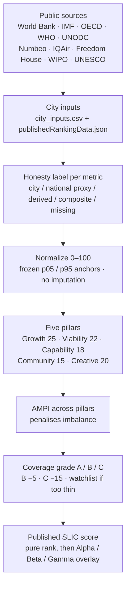

# SLIC Index V3 — The Ranking That Disagrees

> "Every city ranking is a lie. Here's ours."

**สร้างเมืองน่าอยู่ · Better City, Better Life.**

The Smart and Liveable Cities Index (SLIC) is a public ranking of cities on what it actually costs to build a life there. It is built as a civic publication, not a black box: the method is in this repo, every published score traces to a source, and a single machine is enough to run it.

The published board in this snapshot (`src/data/publishedRankingData.json`, score model `slic-v3.4.0`) covers **163 cities: 158 ranked + 5 watchlist**. Five pillars. **22 scored signals + 3 diagnostics.** No paywall. No proprietary scoring engine. No 12-month lobby cycle.

Those counts are snapshot-sensitive. They can disagree with other listings in this repo, and that disagreement is left visible rather than rounded into a prettier number:

| Layer | What it is | Count in this checkout |
|--------|------------|------------------------|
| Published JSON | Ranked + watchlist cities on the public board | **163** (158 ranked + 5 watchlist) |
| CSV download | `public/downloads/slic-ranked-cities-v2.csv` | **158 ranked rows** (watchlist omitted) |
| Universe roster | `src/data/slic_city_universe.csv` | **352** candidate cities (353 lines including header) |

SLIC is the first city ranking that admits what it measures and why. EIU calculates hardship pay for expats. Mercer does the same for HR departments. Resonance measures Instagram buzz. Monocle curates lifestyle for the already-rich. Yonsei counts smart city apps without asking if they help anyone.

SLIC measures what's left after rent.

---

## What this is

SLIC Index V3 is an open-source city ranking **and** an editorial site: op-ed homepage, interactive ranking, per-city scorecards, methodology with equations, and a comparison against other global indices.

It is a project of **Dr Non Arkaraprasertkul** (Dr. Non Arkara in the publication credits) with **Associate Professor Poon Thiengburanathum**, built in the civic-studio practice of **Axiom X Co., Ltd.** — a one-desk civic systems lab. ReTL is the product/presentation partner on the public surface. Computing infrastructure has been supported in kind by Thai public agencies (see [Created by](#created-by)); that support is not a ranking endorsement, a UN mandate, or a paid placement.

The site ships in **English, Thai, and Chinese** as the core publication locales (Thai first-person on the site is **ผม**). Korean and Japanese UI labels exist; long-form pages may still fall back to English.

### What makes V3 different

- **Op-ed editorial homepage** — not a dashboard, a publication. Makes the argument, shows the evidence, hands you the tool.
- **Eleven-index comparison** — side-by-side with EIU, Mercer, Resonance, Monocle, Yonsei-Cambridge, IMD, Global Power City Index, Oxford Economics, Hanke Annual Misery, SLIC Soft Power, and Happy City. Hover any city to see where else it appears.
- **Blind spots diagram** — checkmark grid showing what each index measures. SLIC is the only one that covers all eight dimensions.
- **Interactive spider** — drag to rebuild SLIC's top 10 based on your priorities. The other indices stay frozen.
- **Watchlist transparency** — war zones and cities with insufficient data are on our watchlist, not quietly dropped.
- **Multilingual** — English, Thai, Chinese. Every piece of core copy.

The manga banner above is editorial art for the civic brief (housing, jobs, health, mobility, environment). The **published scoring schema** is the five pillars below, not those five illustration panels.

---

## Philosophy

Fork the **method**, not the secrets. The ranking is meant to be cloned, recalculated, criticised, and taught. API keys, visitor-tracking credentials, and unpublished worksheets are not part of the public claim. If a number cannot be shown with a source, it does not belong on the board.

Serious civic systems should run on **one Mac / one person**. This repo is a static Vite app plus a documented scorer. You do not need a data centre, a vendor lock-in, or a ministry IT department to read a score, replay the math, or stand up a local copy.

There is **no black-box ranking**. Each city scorecard carries per-metric `source`, `sourceUrl`, and `dataLevel`. Missing values are excluded, not imputed. Coverage grades (A / B / C) and a watchlist make thin evidence visible. If two files in this repo disagree about how many cities exist, both figures are listed — we do not invent a third.

The audience is bilingual where the work is bilingual. The public site is **ไทย / English** (and 中文). This README is English-first so forks worldwide can run it; the Thai lines that belong here stay here.

Honesty labels matter more than a glossy composite. A city-level measurement is not the same thing as a national proxy, a derived term, or a declared composite. SLIC names those layers instead of pretending every cell is a sensor in the street.

---

## Ethical use

SLIC is for public citation, teaching, replication, and critique. Use it to argue about cities. Do not use it as a weapon that hides its own rules.

**Do not:**

- **Game scores.** Do not retune weights, drop inconvenient cities, or swap a national proxy for a city reading in order to force a favourite up the board — then present the result as “the” SLIC ranking.
- **Sell the ranking as truth.** A ranking is a declared model. It is not a UN ranking, not a government certification, and not a real-estate prospectus. Do not pitch inclusion, a tier badge, or a methodology change as a paid product.
- **Hide the methodology.** If you republish numbers, keep the source, the pillar weights, the coverage grade, and the measured-vs-modelled labels visible. Do not strip provenance and leave a league table.
- **Imply endorsement.** Collaboration logos and in-kind infrastructure support are not a ministry, UN, or sponsor stamp on any city’s rank.
- **Treat modelled values as measured.** National proxies, derived fields, and composites are labelled. Passing them off as city-sensor data is a lie even if the arithmetic is correct.

Suggested credit, from the site footer: *Non Arkara and Associate Professor Poon Thiengburanathum, Smart and Liveable Cities Index (SLIC), public ranking model, accessed [date], plus the deployment URL used.*

---

## How it works

Public sources feed city inputs. Inputs are labelled. Only observed scored metrics enter a pillar. Pillars combine with AMPI. Coverage can penalise the headline score. Alpha / Beta / Gamma is a **public overlay after** pure score rank — not a secret bonus.



### The five pillars

| Pillar | Weight | What it measures |
|--------|--------|------------------|
| **Growth** | 25% | Economic dynamism. What's left after rent. Housing burden. Working-time pressure. |
| **Viability** | 22% | Safety. Transit. Clean air. Digital infrastructure. Climate. |
| **Capability** | 18% | Healthcare access. Education quality. Equal opportunity. |
| **Community** | 15% | Belonging. Tolerance. Cultural life. Whether your neighbors want you there. |
| **Creative** | 20% | Entrepreneurial friction. Innovation intensity. Government stability. |

Canonical scorer: `src/publicationMath.js`. Human-readable spec: [`docs/v3-absolute-scoring-specification.md`](docs/v3-absolute-scoring-specification.md). Worked formula: [`docs/v3-absolute-scoring-formula.md`](docs/v3-absolute-scoring-formula.md). Methodology paper (English): [`public/downloads/slic-methodology-technical-paper-en.pdf`](public/downloads/slic-methodology-technical-paper-en.pdf).

### Honesty labels — measured vs modelled

Every metric line on a city scorecard carries a `dataLevel`. In the UI:

| `dataLevel` | EN label | TH label | Treat it as |
|-------------|----------|----------|-------------|
| `city` | City data | ข้อมูลระดับเมือง | **Measured** at city / metro |
| `national` | National proxy | ตัวแทนระดับประเทศ | **Modelled / fallback** — country standing in for the city |
| `derived` | Derived | คำนวณต่อยอด | **Modelled** from other observed inputs |
| `composite` | Composite | ค่าผสม | **Modelled** mix of declared components |
| `missing` | No data | ไม่มีข้อมูล | Excluded. Not filled in. |

Absolute scoring: adding a new city does not rewrite everyone else’s history. Coverage is weighted; missing data is dropped from the average, not invented.

---

## Live

**[View V3 →](https://slic.nonarkara.org/)** (Cloudflare Pages, custom domain)
**[Mirror →](https://nonarkara.github.io/SLIC-Index/)** (GitHub Pages)

---

## Version history

| Version | What changed | Live |
|---------|-------------|------|
| **[V1](https://github.com/Nonarkara/slic-landing-page)** | 103 cities. The LinkedIn provocation that started it all. | [GitHub Pages](https://nonarkara.github.io/SLIC-Index-V1/) |
| **[V2](https://github.com/Nonarkara/SLIC-Index-V2)** | SCSE 2026 Taipei launch. Interactive spider. 174 cities. European mayors asked to replace The Economist's index. | [GitHub Pages](https://nonarkara.github.io/SLIC-Index-V2/) |
| **V3** (you are here) | Op-ed redesign. 158 ranked cities + 5 watchlist (163 total in the published JSON). Index comparison (eleven profiles on the live compare page). Blind spots diagram. Watchlist transparency. AMPI absolute scoring. Public-tier overlay (Alpha/Beta/Gamma) with A-grade coverage floor for Alpha. | [slic.nonarkara.org](https://slic.nonarkara.org/) |

---

## Run it / fork it

One person, one laptop, Node, and this tree. Visitor tracking is optional and **not required** to rank cities or render the site.

### Requirements

- **Node.js 20+** (GitHub Actions on this repo uses Node 22)
- npm (lockfile is `package-lock.json` — use `npm ci` for a clean install)

You do **not** need Supabase, Wrangler, or any secret to develop locally.

### Install and run

```bash
git clone https://github.com/Nonarkara/SLIC-Index.git
cd SLIC-Index
npm ci
npm run dev          # Vite at http://127.0.0.1:5173
```

```bash
npm run typecheck    # tsc --noEmit
npm run build        # vite build → dist/
npm run preview      # production preview at http://127.0.0.1:4176
npm test             # publication / regression tests
```

Optional: `npm start` serves the already-built `dist/` with Express (default port `10000`).

### Integrity (before you trust a number you changed)

```bash
npm run check:publication
npm run check:methodology
npm run verify:math   # rescore + publication + methodology + tests
```

`npm run rescore` rewrites the published snapshot from raw metric rows. Run it only when you intend to change scores. After a data edit, keep these three aligned:

- `data/verified_sources/city_inputs.csv`
- `src/data/publishedRankingData.json`
- `public/downloads/slic-ranked-cities-v2.csv`

### Optional visitor tracking

The ranking does not depend on analytics. If you wire tracking in a private fork, the app reads `VITE_SUPABASE_URL` and `VITE_SUPABASE_ANON_KEY` (anon key only). Leave them unset and the client stays inert. Do not commit `.env` files. Do not publish service-role keys. Fork the method; keep credentials out of git.

### Fork without pretending it is still SLIC

Change weights, cities, or sources if you want a different argument. Keep the method visible. Do not keep the SLIC name, the DEPA/PMU-A/ReTL lockup, or this domain on a board you have silently rewritten. Cite this repo, show your diffs, and label modelled cells as modelled.

Custom CSS only — no Tailwind. Design tokens live in `src/styles.css`.

---

## Tech stack

- React 19 + TypeScript 5.8 + Vite 6 (no Tailwind — custom CSS only)
- Interactive spider web allocator (custom SVG + pointer events)
- Real-time city re-ranking with zero-sum weight allocation
- Visitor tracking (Google Sheets + Supabase dual-write, with Cloudflare Web Analytics) — optional, not part of scoring
- Static deployment: Cloudflare Pages (production at slic.nonarkara.org) + GitHub Pages mirror

---

## Created by

**Dr Non Arkaraprasertkul** (publication credit: **Dr. Non Arkara**) and **Associate Professor Poon Thiengburanathum**, in the civic-studio practice of **Axiom X Co., Ltd.**, with research-pipeline and presentation collaboration **Axiom × ReTL**.

In-kind computing/platform support and public-interest collaboration (logos on the site, not a rank-for-hire arrangement):

- Ministry of Digital Economy and Society, Thailand
- Digital Economy Promotion Agency (depa)
- Smart City Thailand Office
- PMU-A (Program Management Unit for Area-Based Development)

The index has no commercial relationship with any city beyond that infrastructure support. No city, developer, government, vendor, or sponsor paid for inclusion, weighting, placement, or editorial treatment. Agency logos are not a claim that SLIC is an official UN, ministry, or cabinet ranking.

---

## License

There is no separate SPDX `LICENSE` file in this checkout. Reuse follows the publication protocol already on the live site:

SLIC is intended for public citation, teaching, replication, and critique. Keep the source visible, preserve the declared methodology, and do not imply paid placement or endorsement.

Underlying statistical series remain under their original publishers’ terms (World Bank, IMF, OECD, and so on). You inherit those terms when you copy raw values; you do not inherit a right to rebrand those agencies as SLIC co-authors.

---

*SLIC is free, public, and transparent. Every number traces back to its source. No city, developer, government, vendor, or sponsor paid for inclusion, weighting, placement, or editorial treatment in this index.*
